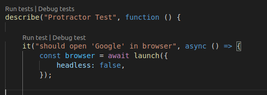

# Run/Debug Protractor Tests

An extension that allows running and debugging protractor tests both individually and collectively.

## Extension Settings

This extension contributes the following settings:

- `protractor.path`: Path to protractor executable file for tests execution.
- `protractor.config.path`: Path to protractor configuration file (protractor.conf.js) to use for tests execution.

## History

See changelog

## License

This software is released under [MIT License](http://www.opensource.org/licenses/mit-license.php)
